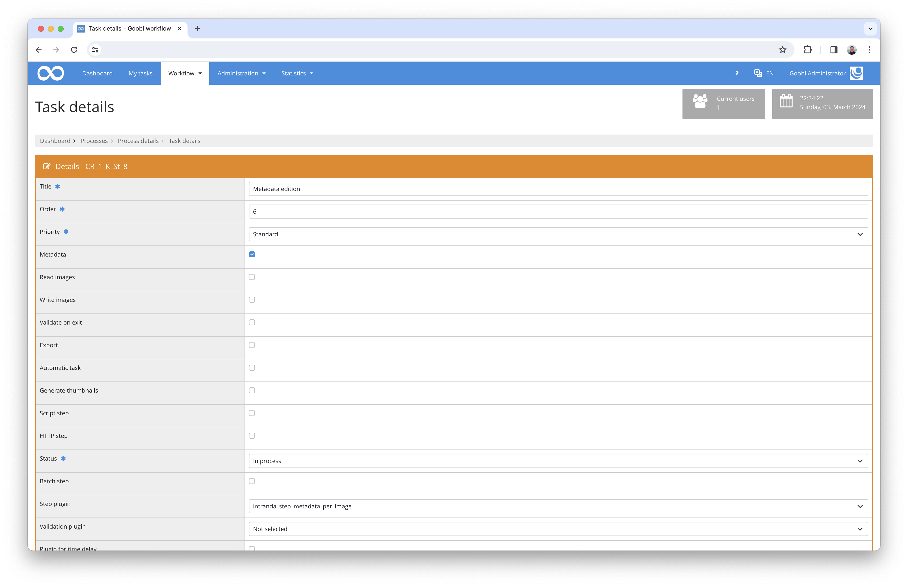
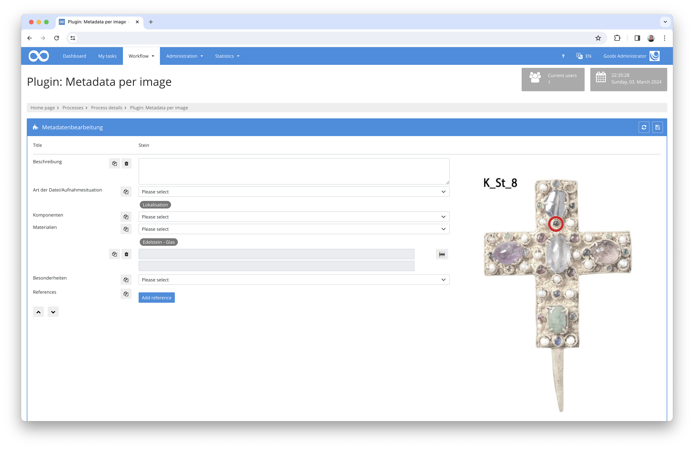

## Introduction
This plugin allows you to edit configurable metadata within the user interface of an open task without having to enter the metadata editor. You can create your own metadata for each audio, video or image file.


## Installation
To install the plugin, the following two files must be installed:

```bash
/opt/digiverso/goobi/plugins/step/plugin_intranda_step_metadata_per_image-base.jar
/opt/digiverso/goobi/plugins/GUI/plugin_intranda_step_metadata_per_image-gui.jar
```

To configure how the plugin should behave, various values can be adjusted in the configuration file. The configuration file is usually located here:

```bash
/opt/digiverso/goobi/config/plugin_intranda_step_metadata_per_image.xml
```


## Overview and functionality
To activate the plugin, it must be activated for one or more desired tasks in the workflow. This is done by selecting the `intranda_step_metadata_per_image` plugin from the list of installed plugins.



When the plugin is entered, separate structural elements are created for all files. The structure elements are listed. The metadata fields can be seen on the left and the image, video or audio file on the right. Click on the image to open it in full screen mode.
The individual structural elements can be reorganised to put the files in the desired order.



The configured metadata is displayed for each structural element. Depending on the configuration, there are options on the left-hand side to duplicate or delete a single field or to add a value to all structural elements at the same time.

The links are a special feature. This makes it possible to create a link between the current structure element and another process. This opens a pop-up in which you can search for other processes. The desired process can then be selected from the hit list. A link to the selected task is then created in the structure element and a link to the current structure element is created in the other task. 

If a link is removed again, it is also removed from the selected process.


## Configuration
The configuration of the plugin is structured as follows:

```xml
<config_plugin>

    <config>
        <project>*</project>
        <step>*</step>
        <field
            label="Beschreibung"
            metadataField="ContentDescription"
            repeatable="false"
            displayType="textarea"
            defaultValue=""
            required="false"
            validation=""
            readonly="false"
            helpText="Hier kann der Inhalt des Bildes beschrieben werden."
        />

        <field
            label="Komponenten"
            metadataField="SubjectForm"
            repeatable="true"
            displayType="multiselect"
            defaultValue=""
            required="false"
            readonly="false"
            helpText="Wählen Sie hier die auf dem Bild zu sehenden Komponenten aus.">
            <vocabulary>Components</vocabulary>
        </field>
    

        <field label="Besonderheiten" metadataField="Characteristics" repeatable="false" displayType="gnd" defaultValue="" 
        required="false" readonly="false" />        

        <reference>
            <group>Reference</group>
            <process>RelationProcessID</process>
            <docstruct>RelationDocstructID</docstruct>
            <image>RelationImageNumber</image>
            <identifier>RelationExternalIdentifier</identifier>
            <label>RelationLabel</label>
        </reference>
        
        <searchfield>TitleDocMain</searchfield>
        <searchfield>ContentDescription</searchfield>
        <searchfield>CatalogIDDigital</searchfield>
        <display>
            <field>TitleDocMain</field>
            <field>ContentDescription</field>
            <field>CatalogIDDigital</field>
        </display>
        <identifierField>_urn</identifierField>
        <docstructName>CrownComponent</docstructName>
        <rating>Counter</rating>
    </config>
</config_plugin>
```

The `<config>` block can occur repeatedly for different projects or work steps in order to be able to perform different actions within different workflows. The entries in the `<project>` and `<step>` fields control the task for which an area is valid. The fields can be repeated and the placeholder `*` can be used.

The input fields are then defined. Each of these `<field>` elements consists of a series of mandatory entries. The `label` attribute contains the name to be displayed. Multilingualism is supported. A message key can also be entered here instead of the label. `helpText` contains a help text that can optionally be displayed. A message key can also be used here.

In `metadataField` is the metadata from which existing values are to be read or into which new values are to be saved, in `defaultValue` a default can be defined which is used if the field is empty. Optionally, a regular expression can be entered in `validation`. If the field is not empty, the system checks whether the value entered corresponds to the expression. In this case, an error message can be defined in `validationErrorMessage`.

Using `repeatable="true/false"` controls whether a field is repeatable or not, `required="true/false"` controls whether a validation takes place that at least one field of this type has been filled in and `readonly="true/false"` defines whether read or write access is possible.

The field type is defined in the `displayType` attribute. The following types are available:


### Single input field
```xml
        <field
            label="language"
            metadataField="DocLanguage"
            repeatable="true"
            displayType="input"
            defaultValue=" - bitte eintragen - "
            required="false"
            validation="[a-z]{3}"
            validationErrorMessage="Der Wert muss ein dreistelliger ISO 639 Wert sein." />
```


### Multiline input field
```xml
        <field 
            label="Beschreibung"
            metadataField="ContentDescription"
            repeatable="false"
            displayType="textarea"
            defaultValue=""
            required="false"
            validation=""
            readonly="false"
            helpText="Hier kann der Inhalt des Bildes beschrieben werden." />
```


### Selection list
There are two options for configuring the possible values. Firstly, you can specify a vocabulary that has already been created in Goobi:

```xml
        <field
            label="Art der Datei/Aufnahmesituation"
            metadataField="ImageType"
            repeatable="true"
            displayType="select"
            defaultValue=""
            required="false"
            readonly="false"
            helpText="Bildtyp.">
            <vocabulary>ImageType</vocabulary>  
        </field>
```

Or the list of values is specified in the configuration file:
```xml
        <field
            label="Art der Datei/Aufnahmesituation"
            metadataField="ImageType"
            repeatable="true"
            displayType="select"
            defaultValue=""
            required="false"
            readonly="false"
            helpText="Bildtyp.">
            <field>value A</field>
            <field>value B</field>
            <field>value C</field>
        </field>
```


### Multiple selection 
Here too, there are two options for configuring the possible values: using a vocabulary or specifying the values in the configuration file:

```xml
        <field
            label="Komponenten"
            metadataField="SubjectForm"
            repeatable="true"
            displayType="multiselect"
            defaultValue=""
            required="false"
            readonly="false"
            helpText="Wählen Sie hier die auf dem Bild zu sehenden Komponenten aus.">
            <vocabulary>Components</vocabulary>
        </field>

        <field
            label="Komponenten"
            metadataField="SubjectForm"
            repeatable="true"
            displayType="multiselect"
            defaultValue=""
            required="false"
            readonly="false"
            helpText="Wählen Sie hier die auf dem Bild zu sehenden Komponenten aus.">
            <field>value A</field>
            <field>value B</field>
            <field>value C</field>
        </field>
```

This field defines a selection list with the desired values. Once a value has been selected, it is removed from the selection list and displayed as a badge below the field. If you click on the badge, it is removed and the value is available again in the selection list. 


### GND search 

```xml
        <field
            label="Schlagwort"
            metadataField="SubjectTopic"
            repeatable="false"
            displayType="gnd"
            defaultValue=""
            required="false"
            readonly="false" />
```

This field defines a GND search field. This means that it is not possible to edit the value manually. Instead, there is the option to search in the GND and select a value there, which is then imported. 


### Geonames search 
```xml
        <field
            label="Place"
            metadataField="PlaceOfPublication"
            repeatable="false"
            displayType="geonames"
            defaultValue=""
            required="false"
            readonly="false" />
```

This field defines a geonames search field. This means that it is not possible to edit the value manually. Instead, there is the option to search in Geonames and select a value there, which is then imported.


### VIAF search 
```xml
        <field
            label="Schlagwort"
            metadataField="SubjectTopic"
            repeatable="false"
            displayType="viaf"
            defaultValue=""
            required="false"
            readonly="false" />
```
This field defines a VIAF search field. This means that it is not possible to edit the value manually. Instead, there is the option to search in VIAF and select a value there, which is then imported.

After the field definition, you configure how references to other processes are saved:

```xml
        <reference>
            <group>Reference</group>
            <process>RelationProcessID</process>
            <docstruct>RelationDocstructID</docstruct>
            <image>RelationImageNumber</image>
            <identifier>RelationExternalIdentifier</identifier>
            <label>RelationLabel</label>
        </reference>
```

For this purpose, the metadata group and the metadata contained therein in which the references are saved are defined.

The last step is to configure how the search for references works:

```xml
        <searchfield>TitleDocMain</searchfield>
        <searchfield>ContentDescription</searchfield>
        <searchfield>CatalogIDDigital</searchfield>

        <display>
            <field>TitleDocMain</field>
            <field>ContentDescription</field>
            <field>CatalogIDDigital</field>
        </display>
```

The metadata fields to be searched for the desired values are defined in <searchfield> and the metadata fields to be displayed in the hit list are defined in <display>.
